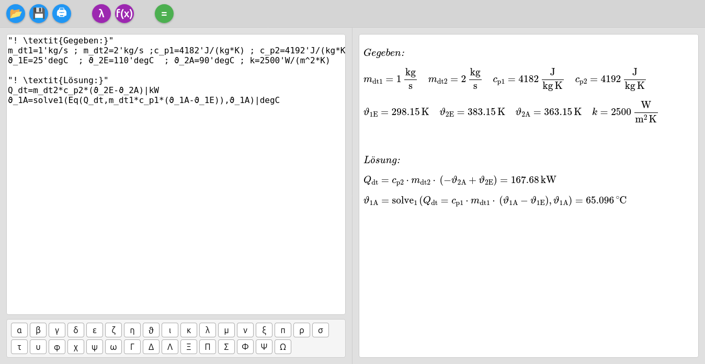
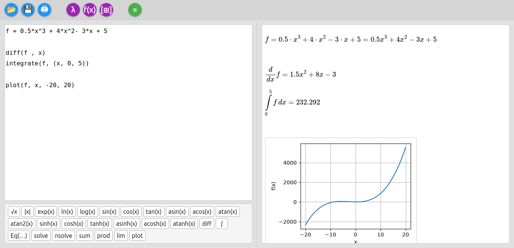
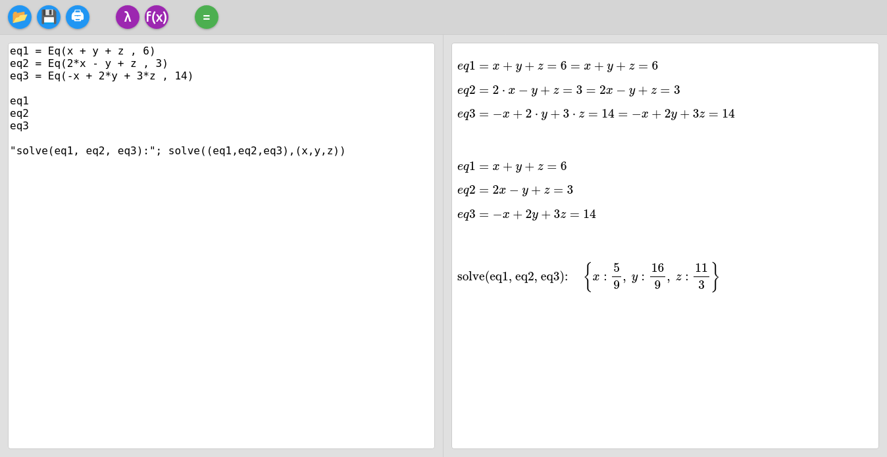
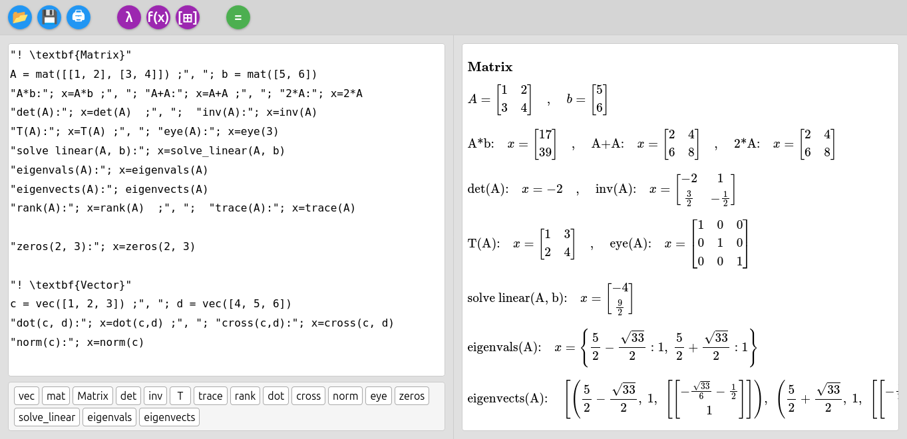

# CalcOn Pad

CalcOn Pad is a small browser-based calculation notebook built with Python, Flask, SymPy, Matplotlib, and NumPy.

It lets you:

- Perform calculations with physical units (`m`, `s`, `kg`, `N`, `J`, `W`, `Pa`, `bar`, `atm`, `V`, `A`, `Ohm`, `K`, `degC`, `Hz`, `rpm`, `L`, …)
- Convert results explicitly to target units using `|` syntax
- Do symbolic math (derivatives, integrals, equations, sums, products, limits)
- Work with vectors and matrices
- Generate plots directly in the browser
- View results as nicely formatted LaTeX via MathJax
- Insert Greek symbols and common function snippets from the UI
- Load and save calculation files via the web UI
- Print the output in a print-optimized layout

The interface consists of a text editor on the left and a LaTeX/plot output area on the right.

## Screenshot





## Features

- Web UI using Flask, HTML/CSS/JavaScript and MathJax
- SymPy integration for
  - symbolic expressions (`diff`, `integrate`, `Eq`, `solve`, `nsolve`, `sum`, `prod`, `lim`)
  - numeric evaluation
  - symbolic display mode via `:=`
- Unit system with convenient input:
  - apostrophe syntax for units: `10'J`, `3's`, `5'm`, `10'kg`, `5'W/(m*K)`, …
  - automatic unit simplification for output
  - explicit target units using the `|` syntax (for example `| kWh`, `| bar`, `| Pa`, `| m`)
- Plotting function: `plot(f, x, xmin, xmax)` generates a PNG plot with Matplotlib and shows it in the browser
- Matrix and vector support:
  - `vec`, `mat`, `Matrix`
  - `det`, `inv`, `T`, `trace`, `rank`
  - `dot`, `cross`, `norm`
  - `eye`, `zeros`, `ones`
  - `solve_linear`, `eigenvals`, `eigenvects`
- Text lines in double quotes are rendered as LaTeX text
- Text lines starting with `!` are inserted as raw LaTeX
- Greek variables are automatically rendered as LaTeX symbols
- Toolbar buttons for open, save, print, symbols, functions, matrices/vectors, and run
- Print stylesheet that hides the editor and prints only the formatted output

## Requirements

- Python 3
- Python packages:
  - `flask`
  - `sympy`
  - `matplotlib`
  - `numpy`

Install the dependencies, for example:

```bash
pip install flask sympy matplotlib numpy
```

## Running from source

The main script is called `CalcOnPad.py`.

Start the application with:

```bash
python CalcOnPad.py
```

By default, the Flask application runs on:

```text
http://127.0.0.1:5000
```

When running as a normal Python script, it starts the Flask development server.
When running as a packaged/frozen executable, it starts the server and opens the browser automatically.

## Building a standalone binary (PyInstaller)

You can build a single executable using PyInstaller.

### 1. Install PyInstaller

```bash
pip install pyinstaller
```

### 2. Make sure the project structure looks like this

```text
CalcOnPad.py
templates/
  index.html
```

### 3. Build the executable on Linux / macOS

```bash
pyinstaller \
  --name CalcOnPad \
  --onefile \
  --add-data "templates:templates" \
  CalcOnPad.py
```

After a successful build, the executable will be in the `dist/` folder.

Run it with:

```bash
./dist/CalcOnPad
```

### 4. Build the executable on Windows

On Windows, the separator in `--add-data` is `;` instead of `:`:

```bash
pyinstaller ^
  --name CalcOnPad ^
  --onefile ^
  --add-data "templates;templates" ^
  CalcOnPad.py
```

The executable will be created in:

```text
dist\CalcOnPad.exe
```

## Usage

### User interface

- Left side: textarea for the calculation code
- Right side: output area for LaTeX formulas and plots

- Top toolbar:
  - Open file: load a local text file into the editor
  - Save file: download the current editor content as a text file
  - Print: open the browser's print dialog with a print-optimized layout
  - Greek symbols: insert Greek letters into the editor
  - Functions: insert common math function snippets
  - Matrices / vectors: insert matrix and vector snippets
  - Run (`=`): submit the current code to the server and update the output

### Input syntax

- Basic assignments and calculations

```text
v = 10'm/s
t = 3's
m_a = 10'kg
F = m_a * v / t
```

- Multiple commands on one line

```text
a = 5'm/s^2 ; m = 10'kg ; F = m * a
```

- Units and target units

```text
E = 5'kW * 3'h | kWh
p = 2'bar | Pa
l = 2500'mm | m
```

- Symbolic math

```text
"Symbolic"
f = x^2
diff(f, x)
integrate(f, (x, 0, 1))
solve(Eq(x^2 - 4, 0), x)
```

- Symbolic display mode

```text
f := x^2 + 2*x + 1
df := diff(f, x)
```

- Equation solver

```text
solve(Eq(x^2 - 5, 0), x)
nsolve((x^2 - 2), (x), (1))
```

- Sums, products and limits

```text
sum(i, (i, 0, n))
prod(i, (i, 1, n))
lim(sin(x)/x, x, 0)
```

- Matrix and vector operations

```text
v = vec(1, 2, 3)
w = vec(4, 5, 6)
dot(v, w)
cross(v, w)
norm(v)
```

```text
A = mat([[1, 2], [3, 4]])
det(A)
inv(A)
rank(A)
trace(A)
```

- Plots

```text
f = sin(x)
plot(f, x, 0, 2*pi)
```

- Comments / text

```text
"Example calculation with units"
"Heat transfer example"
```

- Raw LaTeX

```text
"!\frac{a}{b}"
```

### Greek variables

Greek letters can be used directly in variable names, for example:

```text
α = 30'deg
β = 45'deg
ΔT = 20'K
μ = 0.12
```

## Project structure

A minimal structure:

```text
CalcOnPad.py          # main Flask application (SymPy, units, plotting, formatting)
templates/
  index.html          # HTML template with editor, toolbar, panels and MathJax
```

## License

This project is licensed under the GNU General Public License v3.0 (GPL-3.0).
See the `LICENSE` file for details.
