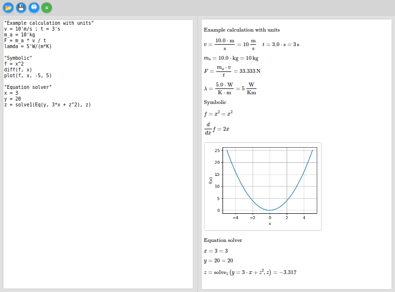

# CalcOn Pad

CalcOn Pad is a small browser‑based calculation notebook built with Python, Flask, SymPy, and Matplotlib.

It lets you:

- Perform calculations with physical units (`m`, `s`, `kg`, `N`, `J`, `W`, `Pa`, `bar`, `atm`, `V`, `A`, `Ohm`, …)
- Do symbolic math (derivatives, integrals, equations)
- Generate plots directly in the browser
- View results as nicely formatted LaTeX via MathJax
- Load and save calculation files via the web UI

The interface consists of a text editor on the left and a LaTeX/plot output area on the right.

## Screenshot



## Features

- Web UI using Flask, HTML/CSS/JavaScript and MathJax
- SymPy integration for
  - symbolic expressions (`diff`, `integrate`, `Eq`, `solve`, `solve1`)
  - numeric evaluation
- Unit system with convenient input:
  - apostrophe syntax for units: `10'J`, `3's`, `5'm`, `10'kg`, `5'W/(m*K)`, …
  - automatic conversion to preferred units (`N`, `J`, `W`, `Pa`, `bar`, `atm`, `V`, `A`, `Ohm`) where possible
  - explicit target units using the `|` syntax (for example `| kWh`, `| bar`)
- Plotting function: `plot(f, x, xmin, xmax)` generates a PNG plot with Matplotlib and shows it in the browser
- Text lines in double quotes are rendered as LaTeX text (for example section headers or comments)
- Greek variable names (`alpha`, `beta`, `phi_1`, …) are automatically converted to the corresponding LaTeX symbols


## Requirements

- Python 3
- Python packages:
  - `flask`
  - `sympy`
  - `matplotlib`
  - `numpy`

Install the dependencies, for example:

```bash
pip install flask sympy matplotlib numpy
```


## Running from source

The main script is called CalcOnPad.py.

Start the application with:

```bash
python CalcOnPad.py
```

By default, a Flask development server will run on http://127.0.0.1:5000 and the application will open in your default web browser.

If you prefer to control the browser manually, you can comment out or remove the webbrowser.open("http://127.0.0.1:5000") call in CalcOnPad.py.

## Building a standalone binary (PyInstaller, Linux)

You can build a single executable using PyInstaller.
## 1. Install PyInstaller
```bash
pip install pyinstaller
```

## 2. Make sure the project structure looks like this
```bash
CalcOnPad.py templates/ index.html
```
(The index.html file is the Jinja2 template used by Flask.)

## 3. Build the executable (Linux)

In the project directory, run:
```bash
pyinstaller \ --name CalcOnPad \ --onefile \ --add-data "templates:templates" \ CalcOnPad.py
```

Explanation:

    --onefile creates a single binary.
    --add-data "templates:templates" tells PyInstaller to include the templates folder and make it available as templates at runtime (colon : is the separator on Linux).

After a successful build, the executable will be in the dist/ folder:
dist/ CalcOnPad

You can run it with:
```bash
./dist/CalcOnPad
```

This will start the embedded Flask server and open the application in your browser, just like when running python CalcOnPad.py.

## Note for Windows users

On Windows, the path separator in --add-data is a semicolon instead of a colon. The equivalent command would be:
pyinstaller ^ --name CalcOnPad ^ --onefile ^ --add-data "templates;templates" ^ CalcOnPad.py

(You can adapt this if you later add a static/ directory or other resources.)

## Usage
### User interface

- Left side: textarea for the calculation code
- Right side: output area for LaTeX formulas and plots

- Top toolbar:
  - Open file: load a local text file into the editor
  - Save file: download the current editor content as a text file
  - Print: open the browser's print dialog with a print‑optimized layout
  - Run (=): submit the current code to the server and update the output

### Input syntax

- Basic assignments and calculations v = 10'm/s ; t = 3's m_a = 10'kg F = m_a * v / t
  - A semicolon (;) separates multiple commands on one line.
  - Units are attached using an apostrophe, for example 10'm/s.

- Units and target units E = 5'kW * 3'h | kWh p = 2'bar | Pa
  - To the right of | you can specify a desired target unit (for example kWh, Wh, J, N, W, Pa, bar).

- Symbolic math "Symbolic" f = x^2 diff(f, x) integrate(f, (x, 0, 1))
  - You can use diff, integrate, Eq, solve, solve1 and other SymPy functions that are exposed in the environment.

- Equation solver "Equation solver" x = 3 y = 20 z = solve1(Eq(y, 3*x + z^2), z)
  - solve1(expr, var) returns the first solution for var.

- Plots "Plot example" f = x^2 plot(f, x, -5, 5)
  - Syntax: plot(function, variable, xmin, xmax).
  - The function can be a previously defined variable (f) or a direct expression like x^2.

- Comments / text "Example calculation with units" "Heat transfer example"
  - Text in double quotes is rendered as normal LaTeX text (\text{...}) in the output.

## Project structure

A minimal structure:
CalcOnPad.py # main Flask application (SymPy, units, plotting) templates/ index.html # HTML template with editor, toolbar and MathJax integration

## License

This project is licensed under the GNU General Public License v3.0 (GPL-3.0).
See the LICENSE file for details.

## Version

Current version: 0.9.0
